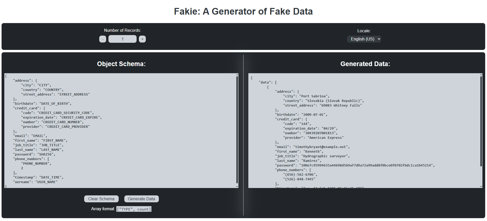

# dev-tools

This is a ***wip***. Modules can be subject to major changes.

---

## Install devtools

To make the tool available from anywhere (add to PATH). Run this command from within 
the root of the prpject.

```bash
$ pipx install --editable .  # pip install -e .
```

You may need to close / open your command line tool to have ``devtools`` available.

---

## Available modules

````
$ devtools --help
usage: devtools [-h]
                {color_converter,http_status,lorem_ipsum,text_stats,dir_tree,fakie}
                ...

A CLI tool.

positional arguments:
  {color_converter,http_status,lorem_ipsum,text_stats,dir_tree,fakie}
                        Subcommands
    color_converter     Convert between different color formats.
    http_status         Defines all HTTP status code.
    lorem_ipsum         Generate lorem ipsum text.
    text_stats          Generates statistics on a text.
    dir_tree            Prints out the directory hierarchy.
    fakie               Start Fakie server to mock data.

options:
  -h, --help            Show the 'devtools' usage guide.
````

### color_converter

````
$ devtools color_converter --help
usage: devtools color_converter [-h]
                                (--cmykRgb COLOR | --hexRgb COLOR | --hslRgb COLOR | --hsvRgb COLOR | --rgbCmyk COLOR | --rgbHex COLOR | --rgbHsl COLOR | --rgbHsv COLOR)

options:
  -h, --help       Show the 'color_converter' tool usage guide.
  --cmykRgb COLOR  Conversion from CMYK to RGB. Format: cmyk(c, m, y, k) (default:
                   None)
  --hexRgb COLOR   Conversion from HEX to RGB. Format: hex(#AABBCC) (default: None)
  --hslRgb COLOR   Conversion from HSL to RGB. Format: hsl(h, s, l) (default: None)
  --hsvRgb COLOR   Conversion from HSV to RGB. Format: hsv(h, s, v) (default: None)
  --rgbCmyk COLOR  Conversion from RGB to CMYK. Format: rgb(r, g, b) (default:
                   None)
  --rgbHex COLOR   Conversion from RGB to HEX. Format: rgb(r, g, b) (default: None)
  --rgbHsl COLOR   Conversion from RGB to HSL. Format: rgb(r, g, b) (default: None)
  --rgbHsv COLOR   Conversion from RGB to HSV. Format: rgb(r, g, b) (default: None)
````

### http_status

````
$ devtools http_status --help
usage: devtools http_status [-h] [--category CATEGORY] [--all] [code]

positional arguments:
  code                 Get definition of a specific HTTP status code. (default:
                       None)

options:
  -h, --help           Show the 'http_status' tool usage guide.
  --category CATEGORY  Show all HTTP status codes in a category: 1xx, 2xx, etc...
                       (default: None)
  --all                Show all available HTTP status codes. (default: False)
````

### lorem_ipsum

````
$ devtools lorem_ipsum --help
usage: devtools lorem_ipsum [-h] [--paragraphs N] [--sentences N]

options:
  -h, --help            Show the 'lorem_ipsum' tool usage guide.
  --paragraphs N, -p N  Number of paragraphs to generate. (default: 3)
  --sentences N, -s N   Number of sentences/paragraphs to generate. (default: 10)
````

### text_stats

````
$ devtools text_stats --help
usage: devtools text_stats [-h] (--file FILE | --string STRING)

options:
  -h, --help       Show the 'text_stats' tool usage guide.
  --file FILE      Path to file. (default: None)
  --string STRING  String of text. (default: None)
````

### dir_tree

````
$ devtools dir_tree --help
usage: devtools dir_tree [-h] [-d DEPTH]

options:
  -h, --help            Show the 'dir_tree' tool usage guide.
  -d DEPTH, --depth DEPTH
                        Limit the depth of the tree. (default: None)
````

### fakie

The generated data is available to copy to clipboard but you will also be prompted to
save to ``.json`` when generating the data.

````
$ devtools fakie --help
usage: devtools fakie [-h] [--host HOST] [--port PORT] [--debug]

options:
  -h, --help   Show help message.
  --host HOST  Host address to bind the server (default: 127.0.0.1)
  --port PORT  Port number to bind the server (default: 5000)
  --debug      Run Flask in debug mode (default: False)
````

<div style="text-align: center;">
  <figure>
    
  </figure>
</div>
